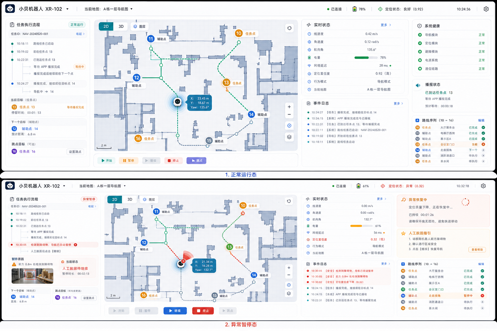

# APP控制台产品化开发方案

## 1. 文档目的

本文档用于明确“机器人导航控制台 / APP”后续的产品化开发方向，目标不是继续做一个依附在 ROS 工作区里的临时调试页，而是规划一套可长期演进、可跨设备访问、可接入权限体系、最终可落地为正式 APP 的独立控制台方案。

本文档重点回答四个问题：

1. 为什么不建议继续把原型堆在当前 ROS 工作区里。
2. 控制台项目应该如何和 ROS 导航系统解耦。
3. 哪些功能可以脱离 ROS 环境独立开发，哪些必须进入联调阶段。
4. 如果最终目标是“做成一个真正能交付使用的 APP”，推荐的技术路线和实施节奏是什么。

## 2. 当前结论

结论很明确：建议将控制台单独立项，作为独立前端项目开发，必要时配套一个独立后端服务，而不是继续塞进当前 `humanoid_ws` / `humanoid_navigation2` 工作区中。

原因如下：

1. 当前 ROS 工作区的职责应聚焦在导航、定位、地图、协议接口、状态推送等机器人底层能力，不适合持续承载重 UI 页面。
2. 后续控制台不仅会有导航控制，还会逐步扩展账号权限、日志检索、地图管理、点位管理、设备状态、录包、异常诊断等模块，体量会明显超过“一个调试网页”。
3. 如果 UI、状态管理、权限体系、样式资源全部混在 ROS 工程里，后续会越来越难维护，也会影响导航侧源码整洁性。
4. Win 开发环境更适合做前端原型、交互、组件封装、视觉打磨和多端适配，不需要每次都依赖 ROS 实机环境。

## 3. 总体目标

目标控制台需要满足以下定位：

1. 既能做开发调试，也能逐步演进为正式业务端。
2. 支持网页端优先，同时保留后续封装为平板端 / 桌面端 APP 的能力。
3. 支持当前已经实现的新导航系统能力：
   - 路线任务导航
   - 任务点 / 辅助点
   - 倒走点
   - 任意跳点
   - 障碍物自动暂停与人工恢复
   - 播报协同
   - 多地图切换
4. 支持完整状态显示：
   - 导航状态
   - 定位状态
   - 机器人状态
   - 通信状态
   - 地图状态
   - 异常状态
5. 支持运维辅助能力：
   - 日志查看
   - rosbag 录制控制
   - 状态历史回看
   - 关键事件追踪

## 4. 为什么不要继续塞进当前 ROS 工作区

如果只是做一个很轻量的调试面板，临时挂在当前工作区里可以接受；但如果目标已经从“调试页”升级为“正式 APP / 控制台”，继续塞在 ROS 工程里会带来明显问题。

### 4.1 工程边界会越来越模糊

当前工作区主要承载：

1. ROS2 节点
2. launch 启动链路
3. Nav2 / 定位 / 地图相关配置
4. WebSocket / 协议桥接
5. 路线任务业务逻辑

如果再把完整前端页面、组件库、状态管理、路由系统、权限模块、打包产物一并放进来，项目边界会很快失控。

### 4.2 不利于多人协作

后续如果前端同学、后端同学、ROS 同学并行开发：

1. 前端并不需要频繁修改 ROS 包。
2. 前端开发节奏通常远高于 ROS 联调节奏。
3. 把 UI 项目独立出来，才能减少互相干扰。

### 4.3 不利于未来产品化

如果后续你要：

1. 做平板端 Web 控制台
2. 做 Electron 桌面端
3. 做 PWA
4. 做账号登录和权限管理
5. 接更多机器人或更多业务系统

那么独立项目会比“嵌在 ROS 工作区里的网页”更可持续。

## 5. 推荐架构

推荐采用“三层结构”：

1. 前端控制台
2. 业务后端 / 网关服务
3. ROS 机器人侧

### 5.1 前端控制台

前端负责：

1. 页面展示
2. 交互控制
3. 状态可视化
4. 地图显示
5. 点位管理界面
6. 日志面板
7. 异常提示
8. 账号登录与权限控制

前端不直接承载机器人业务逻辑，只负责展示和发起操作。

### 5.2 业务后端 / 网关服务

后端负责：

1. 用户鉴权
2. 权限控制
3. 会话管理
4. 前端请求校验
5. 与 ROS WebSocket/HTTP 协议转换
6. 状态汇聚与转发
7. 设备 / 地图 / 点位数据持久化
8. 操作日志记录

这层的价值很大，因为它能把“产品逻辑”和“机器人协议细节”隔开。

### 5.3 ROS 机器人侧

ROS 侧继续只负责：

1. 地图管理
2. 定位
3. 路线任务执行
4. 跳点
5. 播报协同
6. 障碍物暂停恢复
7. 导航状态上报
8. 地图切换与定位链路重启

ROS 侧不要承担前端页面职责。

## 6. 推荐技术栈

如果目标是“先快速做出高质量控制台，再逐步产品化”，推荐如下。

### 6.1 前端推荐

首选方案：

1. `React`
2. `TypeScript`
3. `Vite`
4. `Ant Design` 或 `Arco Design`
5. `Zustand` 或 `Redux Toolkit`
6. `ECharts` 用于状态图表
7. 地图部分优先使用 `Canvas/SVG + 自定义渲染`

原因：

1. 开发效率高
2. 组件生态成熟
3. 状态流容易管控
4. 更适合做复杂控制台

### 6.2 后端推荐

推荐两种路线：

1. `Node.js + NestJS`
2. `Python + FastAPI`

如果你们 APP 后端同学更偏 Java / Node，也可以保持团队已有技术栈，但核心原则是不变的：后端负责协议桥接和业务编排，不把前端直接暴露给 ROS。

### 6.3 桌面 / 平板封装

后续要做 APP 化时，推荐优先级如下：

1. 第一优先：`Web 控制台`
2. 第二优先：`Electron` 封装桌面端
3. 第三优先：如果未来必须做原生跨平台，再评估 `Flutter`

这条路线最稳，因为网页版先成熟后，扩展到桌面和平板会更自然。

## 7. 哪些功能可以脱离 ROS 独立开发

这一点很关键。不是所有东西都要等 ROS 环境。

### 7.1 可完全脱离 ROS 开发的部分

1. 登录页
2. 设备列表页
3. 控制台整体布局
4. 导航控制按钮区
5. 状态栏
6. 异常提示卡片
7. 路线列表区
8. 点位管理弹窗
9. 地图工具栏
10. 日志面板
11. rosbag 录制按钮
12. 假数据驱动的状态切换

这部分只需要基于 mock JSON 即可推进。

### 7.2 必须进入联调阶段的部分

1. 真实 WebSocket 连接
2. ROS 状态订阅
3. 导航控制命令发起
4. 地图切换
5. 点位保存 / 查询
6. 实时机器人位姿
7. 实时速度 / 电量 / 定位质量
8. rosbag 实际录制触发

## 8. 推荐开发节奏

建议按四个阶段推进。

### 8.1 第一阶段：纯原型阶段

目标：

1. 把页面结构定下来
2. 把视觉风格定下来
3. 把导航控制区、状态区、地图区、日志区、异常区定下来

特点：

1. 不依赖 ROS
2. 全部使用 mock 数据
3. 适合在 Win 环境完成

### 8.2 第二阶段：协议适配阶段

目标：

1. 接入我们已经确定的 ROS 协议
2. 能正确发送命令
3. 能正确展示状态

特点：

1. 前端与 mock 层先解耦
2. 用真实接口替换 mock

### 8.3 第三阶段：实机联调阶段

目标：

1. 连真实 ROS
2. 跑开始 / 暂停 / 继续 / 终止 / 跳点
3. 跑障碍物暂停 / 恢复
4. 跑切图
5. 跑点位设置 / 查询 / 路线执行

### 8.4 第四阶段：产品化阶段

目标：

1. 增加权限体系
2. 增加多设备接入
3. 增加操作日志与审计
4. 增加更多诊断能力
5. 增加桌面封装或平板适配

## 9. 页面原型建议

建议先做“一个主控制台页 + 若干业务弹窗”的结构，不要一开始拆太多页面。当前最重要的是把主工作台做扎实，因为导航控制、状态观察、异常处理、日志追查都集中发生在这里。

## 10. 本次确认的正式参考图

本次应以你重新确认的“双状态效果图”为正式视觉参考，而不是上一版单图：



这张图表达了两个关键业务场景：

1. `正常运行态`
2. `异常暂停态`

它比单图更适合指导开发，因为前端不仅要做“页面长什么样”，还要做“状态切换后界面怎么变”。

## 11. 页面信息架构

主控制台页建议固定分成六个区域。

### 11.1 顶部全局栏

用于显示全局公共信息：

1. 机器人名称与编号
2. 当前地图名称
3. WebSocket / 设备连接状态
4. 电量百分比
5. 定位状态摘要
6. 当前时间
7. 设置入口

这一栏是全局区域，不随导航状态切换而消失。

### 11.2 左侧任务执行流程区

左侧栏用于承载“这趟任务正在发生什么”，建议包含：

1. 任务执行流程时间线
2. 当前任务 ID
3. 当前目标点
4. 下一个目标点
5. 跳点目标
6. 等待播报状态
7. 当前停留时长
8. 异常时的暂停原因
9. 异常时的辅助提示卡片

这一区是“任务语义区”，它解决的是“操作员现在到底卡在哪一步”。

### 11.3 中间地图与路径区

这是页面视觉中心，也是操作员第一关注区域，建议包含：

1. 2D / 3D 切换入口
2. 图层开关
3. 地图缩放与回中
4. 栅格地图底图
5. 机器人实时位置
6. 机器人实时朝向
7. 路线折线
8. 已完成段 / 当前段 / 未执行段区分
9. 任务点标记
10. 辅助点标记
11. 当前点、下一个点、跳点目标高亮
12. 机器人跟随式位姿标签
13. 比例尺
14. 异常时的局部警示叠层

地图区的核心目标不是“炫”，而是让人一眼知道机器人在哪、准备去哪、为什么停。

### 11.4 右上实时状态区

用于显示高频数值状态，建议包含：

1. 线速度
2. 角速度
3. 航向角
4. 电量
5. 网络延迟
6. 定位置信度
7. 行为模式
8. 当前地图

这一区建议做成稳定布局，不要因为字段变化频繁抖动。

### 11.5 右侧健康 / 播报 / 路线 / 日志区

右侧剩余区域建议垂直堆叠 4 类卡片：

1. 系统健康
2. 播报状态
3. 路线序列
4. 事件日志

每个卡片职责如下：

1. 系统健康：显示导航模块、定位模块、避障模块、电源系统、通信链路是否正常。
2. 播报状态：显示当前播报点、是否正在等待 APP 播报完成、累计等待时长。
3. 路线序列：显示任务点 / 辅助点列表，以及每个点的状态，如已完成、执行中、待执行、已跳过。
4. 事件日志：按时间倒序显示关键事件，便于快速追因。

### 11.6 底部控制区

底部只放“高价值强动作”按钮，不要把状态信息混进去。建议固定包含：

1. `开始`
2. `暂停`
3. `继续`
4. `终止`
5. `跳点`
6. `开始录包`
7. `停止录包`

其中：

1. 导航控制按钮用于业务操作。
2. 录包按钮属于开发 / 运维辅助操作。
3. “等待播报完成”不是按钮，而应体现在状态区。

## 12. 正常运行态页面要求

正常运行态对应参考图上半部分，应满足以下显示口径：

1. 顶部状态为绿色或中性稳定态。
2. 左侧流程区以“路线正在推进”为主，不强调错误信息。
3. 当前目标点要高亮。
4. 下一个目标点要可见。
5. 地图中已执行路径、当前执行路径、后续路径要有视觉区分。
6. 右侧系统健康应以绿色正常为主。
7. 播报状态如果处于等待 APP 播报，应明确显示“等待播报完成”而不是“导航卡死”。
8. 底部按钮状态要符合业务阶段。

正常运行态不是“所有控件都能点”，而是“按钮要随业务状态受控”。

## 13. 异常暂停态页面要求

异常暂停态对应参考图下半部分，应满足以下要求：

1. 顶部状态栏要明确进入橙色或红色异常提示态。
2. 左侧流程区要能显示暂停发生的时间点。
3. 暂停原因必须明确，不允许只显示“已暂停”。
4. 地图区要保留机器人当前位置，并允许视觉提示异常发生位置。
5. 右侧要出现单独的异常恢复卡片。
6. 如果是人工脱困待继续，要给出明确的人机协同提示。
7. 底部按钮需要切换到“可以继续 / 不可暂停 / 可以终止”的组合。

异常暂停态至少要覆盖以下几类原因：

1. 障碍物自动暂停
2. 人工脱困待继续
3. 播报等待
4. 定位异常恢复中
5. 导航失败待处理

## 14. 按钮可用规则

前端必须把按钮状态做成“受导航状态驱动”的，而不是静态五个按钮永远可点击。

建议按下面规则实现第一版。

### 14.1 未开始

1. `开始` 可用
2. `暂停` 禁用
3. `继续` 禁用
4. `终止` 禁用
5. `跳点` 禁用

### 14.2 运行中

1. `开始` 禁用
2. `暂停` 可用
3. `继续` 禁用
4. `终止` 可用
5. `跳点` 可用

### 14.3 手动暂停

1. `开始` 禁用
2. `暂停` 禁用
3. `继续` 可用
4. `终止` 可用
5. `跳点` 禁用

### 14.4 障碍物暂停

1. `开始` 禁用
2. `暂停` 禁用
3. `继续` 根据业务策略决定
4. `终止` 可用
5. `跳点` 禁用

如果系统允许“人工确认后继续”，则 `继续` 可用；如果要求系统自动恢复，则 `继续` 可以隐藏或禁用。

### 14.5 人工脱困待继续

1. `开始` 禁用
2. `暂停` 禁用
3. `继续` 可用
4. `终止` 可用
5. `跳点` 禁用

### 14.6 等待播报完成

1. `开始` 禁用
2. `暂停` 视业务决定，可保留
3. `继续` 禁用
4. `终止` 可用
5. `跳点` 禁用

这里最重要的是：等待播报不是“暂停按钮点出来的暂停”，前端文案必须区分开。

## 15. 页面组件清单

为了便于实际开发，建议先按组件拆分，而不是按视觉块拆分。

第一版核心组件建议至少包括：

1. `TopStatusBar`
2. `TaskTimelineCard`
3. `CurrentTargetCard`
4. `NextTargetCard`
5. `JumpTargetCard`
6. `PauseReasonCard`
7. `MapCanvasPanel`
8. `RobotPoseBadge`
9. `RealtimeStatusCard`
10. `SystemHealthCard`
11. `BroadcastStatusCard`
12. `RouteSequenceCard`
13. `EventLogCard`
14. `NavControlBar`
15. `RosbagControlBar`
16. `JumpTargetDialog`
17. `WaypointEditorDialog`
18. `MapSwitchDialog`
19. `ExceptionRecoveryCard`

这样拆分后，正常态和异常态可以复用同一套组件，只是数据不同。

## 16. 必做弹窗与交互

第一版至少要实现三个弹窗，否则业务链路不完整。

### 16.1 跳点弹窗

用于：

1. 选择跳到哪个任务点
2. 展示当前路线序列
3. 标识不可跳转或已完成点
4. 确认后发起跳点命令

### 16.2 点位编辑弹窗

用于：

1. 新增点位
2. 编辑点位名称
3. 设置点位角色
4. 设置是否播报
5. 设置倒走属性
6. 查看点位坐标和姿态

### 16.3 地图切换弹窗

用于：

1. 列出可用地图
2. 选择目标地图
3. 提示切图会重置定位与导航准备状态
4. 显示切图是否成功

## 17. 页面状态模型建议

前端不要把页面状态散落在多个临时变量里，建议从一开始就建立统一状态模型。

建议至少分成以下几组：

1. `connectionState`
2. `robotState`
3. `navigationState`
4. `mapState`
5. `routeTaskState`
6. `broadcastState`
7. `obstacleState`
8. `recordingState`
9. `uiState`

其中：

1. `navigationState` 负责运行中、暂停中、等待播报、异常恢复中等主状态。
2. `routeTaskState` 负责路线序列、当前目标、下一个目标、跳点目标、完成进度。
3. `uiState` 负责弹窗开关、当前地图模式、是否跟随机器人视角等前端状态。

## 18. Mock 数据要求

为了让前端在没有 ROS 的情况下也能推进，建议至少准备 6 组 mock 场景：

1. 未开始待命
2. 正常运行
3. 等待播报完成
4. 障碍物暂停
5. 人工脱困待继续
6. 地图切换中 / 定位恢复中

这样做的价值很大，因为它能提前验证：

1. 页面是否抖动
2. 颜色和文案是否准确
3. 按钮状态是否正确
4. 异常态是否真的一眼能看懂

## 19. 为什么建议放到 Win 环境开发

如果当前阶段主要做控制台，不实时依赖 ROS 环境，那么把任务带到 Win 环境开发是非常合理的。

好处如下：

1. 前端开发体验更好。
2. 本地启动和热更新更快。
3. 页面调样式不需要占用机器人环境。
4. 更适合连续做 UI、交互、状态管理和权限体系。
5. ROS 侧保持稳定，不容易被前端原型代码污染。

建议的工作方式是：

1. 在 Win 环境建立独立控制台仓库。
2. 先根据本文档完成页面原型和 mock 状态流。
3. 等页面稳定后，再按既有 ROS 协议做联调。

## 20. 目录建议

建议未来的控制台项目单独建仓，例如：

```text
robot-control-console/
  apps/web-console/
  apps/electron-shell/
  packages/ui/
  packages/types/
  packages/mock-data/
  services/api-gateway/
  docs/
```

如果前期不想做 monorepo，也可以先简化为：

```text
robot-control-console/
  src/
  public/
  mock/
  docs/
```

## 21. 最终建议

综合当前情况，建议如下：

1. 不再把控制台长期堆在当前 ROS 工作区中。
2. 控制台单独立项，优先作为 Web 控制台开发。
3. 页面先按“双状态稿”落地，而不是继续抽象讨论。
4. 先把主控制台页和三个核心弹窗做出来。
5. 在 Win 环境先做页面原型和状态流，不必一开始绑定 ROS。
6. ROS 侧继续保持协议清晰、状态明确、接口稳定。
7. 等 UI 和业务流程稳定后，再进入 ROS 联调与 APP 化封装。

## 22. 后续可继续输出的内容

如果下一步继续推进，我可以直接接着补下面几份文档：

1. `控制台前端项目脚手架方案.md`
2. `控制台页面信息架构与路由设计.md`
3. `控制台前端状态管理设计.md`
4. `控制台与ROS联调接口说明.md`
5. `控制台MVP开发排期.md`

如果你决定正式开做，我下一步建议直接从：

1. 项目脚手架
2. 页面结构
3. mock 数据
4. 状态流原型

这四项开始落地。
